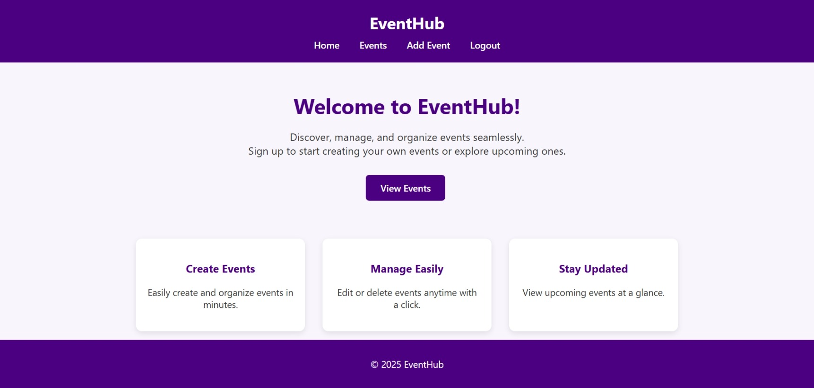
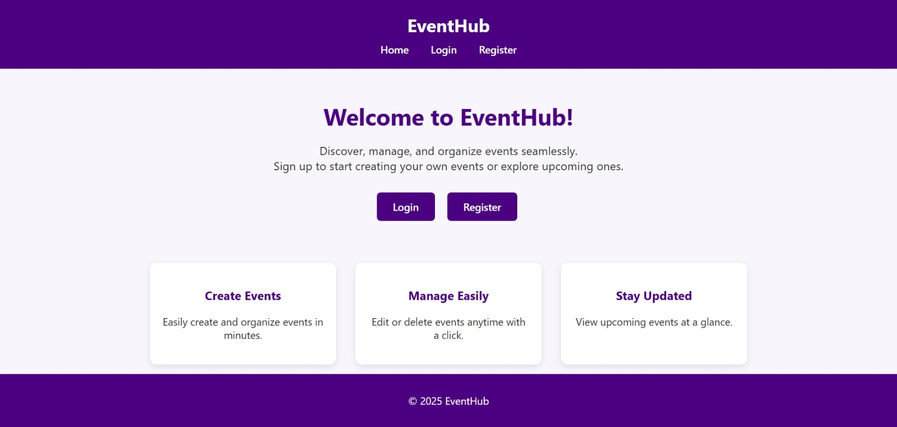
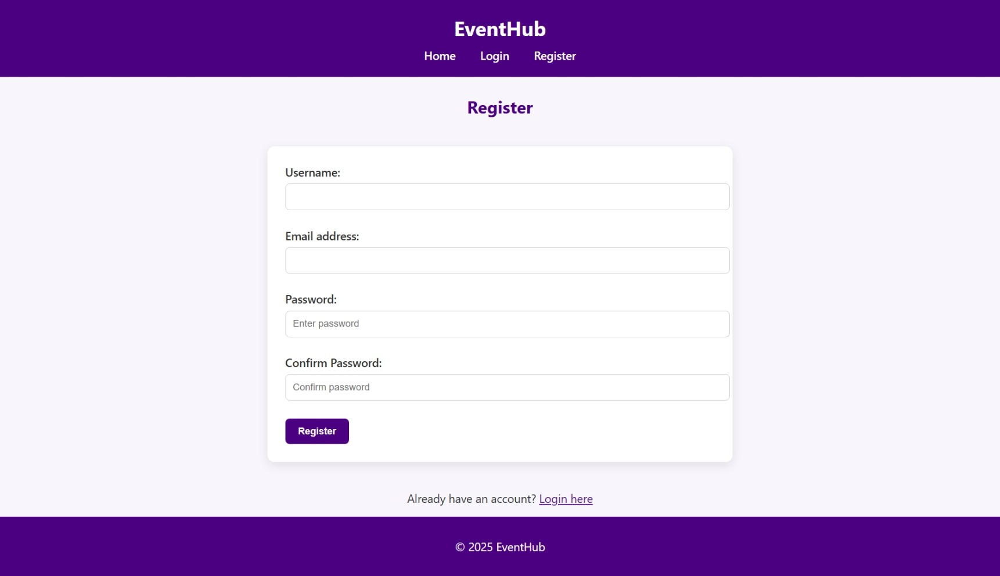
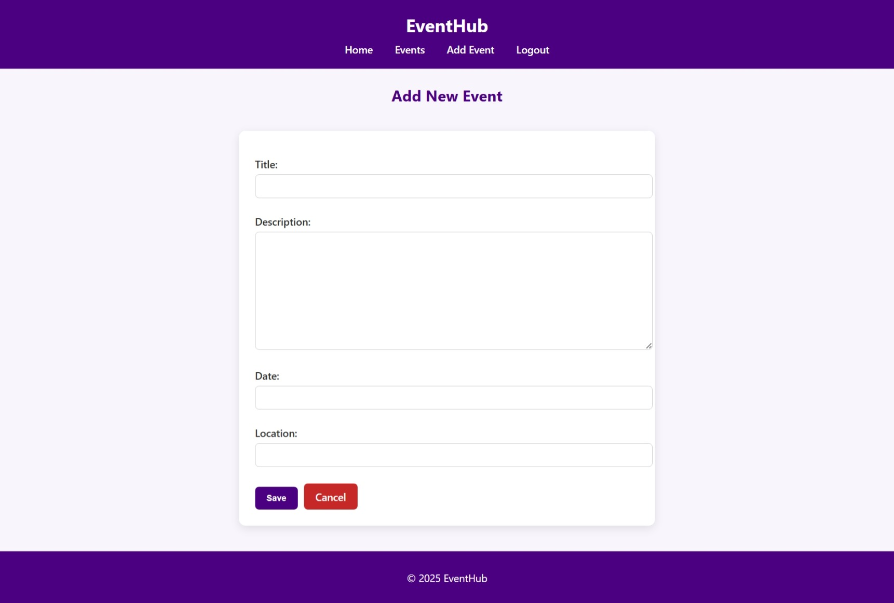

EventHub

EventHub is a web application to create, manage, and view events. Users can register, login, and perform CRUD operations on events. This project is built mainly for learning Django and showcasing a full-fledged project for resume purposes.

📌 Features

User registration and login with authentication.

Create, edit, delete, and view events.

Simple and clean UI with responsive forms and tables.

Flash messages for success/error notifications.

Organized project structure following Django best practices.

💻 Technologies Used

Backend: Django 5.2

Frontend: HTML, CSS

Database: SQLite (default Django DB)

Version Control: Git & GitHub

📷 Screenshots

📷 Screenshots

**Home Page**  

**Register Page**  

**Login Page**  

**Event List Page**  

**Event Create/Edit Page**  

